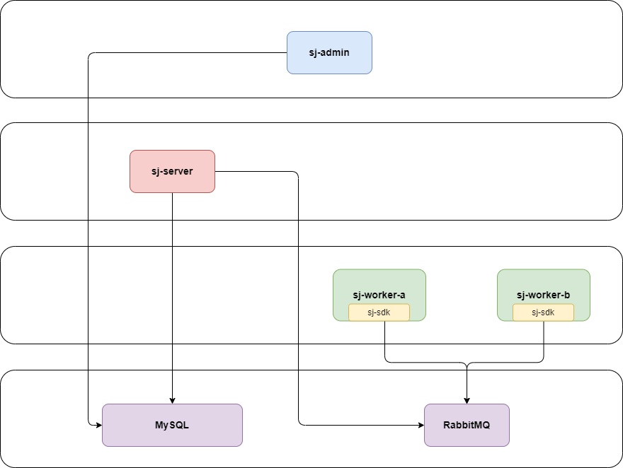

# 架构图

# 结构

- sj-server

- sj-admin

- sj-sdk

# Worker

- 任务执行：接收调度中心的任务请求，执行具体的任务逻辑
- 结果回调：将任务的执行结果回调给调度中心，供用户查看
- 心跳检测：周期性地向调度中心发送心跳信息，证明自己的存活状态

# 特性清单

- 定时任务精度 5 秒

- 定时任务管理

  新增、修改、删除任务，设置任务的触发条件等

- 定时任务执行日志管理

  便于问题排查

- 通过 SDK 完成 worker 工程

- 定时任务 CRON、逻辑删除、启停用、指定触发应用、指定入参等特性支持

- 通过 RabbitMQ 持久化每一条定时任务实例，保证定时任务的顺序执行

- worker 认证 ❌

- worker 可视管理 ❌

  - 维护一张表用于记录 worker 添加、删除
  - 启动成功推送 worker 注册消息
  - 下线由 server 探测感知

- sj-admin 登录 ❌

- sj-admin 用户管理 ❌

- sj-admin 管理界面 ❌

- sj-user-service / sj-job-service